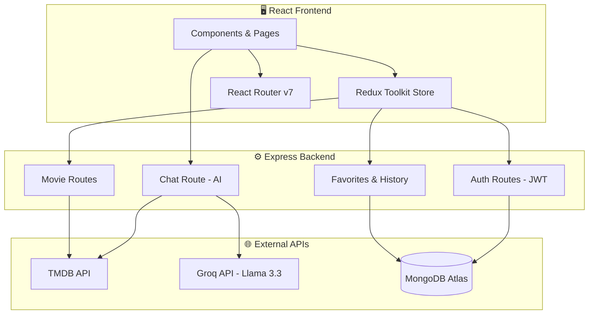

<div align="center">

# 🎬 Moovz

### AI-Powered Movie & TV Show Discovery Platform

[](https://react.dev)
[](https://nodejs.org)
[](https://mongodb.com)
[](https://themoviedb.org)
[](https://groq.com)

[Live Demo](https://moovz.onrender.com/) · [Features](#-top-features) · [Tech Stack](#-tech-stack) · [Setup](#-getting-started) · [Architecture](#-architecture)

</div>

---

## 🔥 Top Features

### 🤖 AI-Powered Chatbot
An intelligent floating chatbot powered by **Llama 3.3 70B** (via Groq). Ask for movie recommendations, actor info, or trending content — every movie/show/actor name in the response is a **clickable link** that navigates directly to its detail page inside the app.

### 🎨 Cinematic Dual Theme
Fully responsive **dark and light mode** with a Netflix-style always-dark hero section. Glassmorphism effects, gradient overlays, and smooth micro-animations throughout.

### 🔐 JWT Authentication
Secure user registration and login with **JWT tokens**, protected routes, role-based access (user/admin), and persistent sessions.

### 🎬 Rich Movie & TV Details
Detailed pages with backdrop heroes, trailers (YouTube), cast with clickable profiles, genre tags, ratings, runtime, budget/revenue, and **watch provider links** (Netflix, Prime Video, Hotstar, etc.) via JustWatch data.

### ⭐ Favorites & Watch History
Logged-in users can save favorites and automatically track viewing history, synced with MongoDB.

### 🔍 Multi-Search
Search across movies, TV shows, and people simultaneously with real-time results and clean UI cards.

### 📱 Fully Responsive
Mobile-first design that works seamlessly across desktop, tablet, and mobile screen sizes.

---

## 🛠 Tech Stack

| Layer | Technologies |
|-------|-------------|
| **Frontend** | React 19, Redux Toolkit, React Router v7, Vite, CSS Variables |
| **Backend** | Node.js, Express.js, JWT, bcryptjs |
| **Database** | MongoDB Atlas, Mongoose ODM |
| **AI** | Groq API (Llama 3.3 70B), TMDB multi-search for link resolution |
| **APIs** | TMDB API (movies, TV, people, images, videos, watch providers) |
| **Design** | Custom CSS with glassmorphism, dark/light theming, micro-animations |

---

## 📁 Project Structure

```
moovz/
├── client/                    # React Frontend
│   ├── src/
│   │   ├── api/               # TMDB & backend API clients
│   │   ├── app/               # Redux store configuration
│   │   ├── components/
│   │   │   ├── ChatBot/       # 🤖 AI chatbot widget
│   │   │   ├── Navbar/        # Navigation with theme toggle
│   │   │   ├── Footer/        # Site footer
│   │   │   ├── MovieCard/     # Reusable movie/show card
│   │   │   └── Loader/        # Loading spinner
│   │   ├── features/          # Redux slices (movies, auth, favorites)
│   │   ├── pages/
│   │   │   ├── Home/          # Hero banner + trending/popular sections
│   │   │   ├── Movies/        # Browse movies with pagination
│   │   │   ├── TVShows/       # Browse TV shows
│   │   │   ├── Details/       # Movie/TV detail with trailer, cast, providers
│   │   │   ├── PersonDetails/ # Actor/crew profiles with filmography
│   │   │   ├── Search/        # Multi-search page
│   │   │   ├── People/        # Browse popular people
│   │   │   ├── Auth/          # Login & Signup
│   │   │   ├── Favorites/     # User's saved favorites
│   │   │   ├── History/       # Watch history
│   │   │   └── Admin/         # Admin dashboard
│   │   └── utils/             # Helper functions
│   └── index.html
│
├── server/                    # Express Backend
│   ├── config/                # MongoDB connection
│   ├── middleware/             # JWT auth middleware
│   ├── models/                # Mongoose schemas (User, Favorite, History)
│   ├── routes/
│   │   ├── auth.js            # Register, login, profile
│   │   ├── movies.js          # Movie-related endpoints
│   │   ├── favorites.js       # CRUD favorites
│   │   ├── history.js         # Watch history tracking
│   │   ├── admin.js           # Admin endpoints
│   │   └── chat.js            # 🤖 AI chatbot (Groq + TMDB link resolver)
│   └── server.js
│
└── README.md
```

---

## 🚀 Getting Started

### Prerequisites
- **Node.js** v18+
- **MongoDB** (Atlas or local)
- **TMDB API Key** — free at [themoviedb.org](https://www.themoviedb.org/settings/api)
- **Groq API Key** *(optional, for AI chatbot)* — free at [console.groq.com](https://console.groq.com)

### 1. Clone the repo
```bash
git clone https://github.com/your-username/moovz.git
cd moovz
```

### 2. Setup Backend
```bash
cd server
npm install
```

Create `server/.env`:
```env
PORT=5000
MONGO_URI=your_mongodb_connection_string
JWT_SECRET=your_jwt_secret_key
TMDB_API_KEY=your_tmdb_api_key
GROQ_API_KEY=your_groq_api_key    # Optional — chatbot works without it
```

Start the server:
```bash
npm run dev
```

### 3. Setup Frontend
```bash
cd client
npm install
```

Create `client/.env`:
```env
VITE_TMDB_API_KEY=your_tmdb_api_key
VITE_TMDB_BASE_URL=https://api.themoviedb.org/3
VITE_TMDB_IMAGE_BASE=https://image.tmdb.org/t/p
VITE_BACKEND_URL=http://localhost:5000/api
```

Start the dev server:
```bash
npm run dev
```

### 4. Open the app
Visit **http://localhost:5173** in your browser 🎬

---

## 🏗 Architecture



---

## 📸 Screenshots

| Dark Mode Home | Light Mode Home |
|:-:|:-:|
| *Cinematic hero with dark gradient* | *Clean light theme with card borders* |

| Movie Details | AI Chatbot |
|:-:|:-:|
| *Always-dark hero + watch providers* | *Clickable movie links in responses* |

---

## 🤖 AI Chatbot — How It Works

1. **User asks a question** → sent to `POST /api/chat`
2. **Backend forwards to Groq** (Llama 3.3 70B) with a system prompt that instructs the AI to wrap movie/show/actor names in `[[double brackets]]`
3. **Backend resolves links** — each `[[Title]]` is searched via TMDB multi-search API to get its ID and media type
4. **Converted to in-app links** — `[[The Dark Knight]]` → `[The Dark Knight](/movie/155)`
5. **Frontend renders clickable links** — React Router `<Link>` components that navigate within the app

---

## 📜 Available Scripts

### Client (Frontend)
| Script | Command | Description |
|--------|---------|-------------|
| **Dev** | `npm run dev` | Start Vite dev server with HMR |
| **Build** | `npm run build` | Production build to `dist/` |
| **Preview** | `npm run preview` | Preview production build locally |
| **Lint** | `npm run lint` | Run ESLint on source files |

### Server (Backend)
| Script | Command | Description |
|--------|---------|-------------|
| **Dev** | `npm run dev` | Start with nodemon (auto-restart) |
| **Start** | `npm start` | Start production server |

---

## 🔑 API Endpoints

| Method | Endpoint | Auth | Description |
|--------|----------|------|-------------|
| `POST` | `/api/auth/register` | ❌ | Create new user account |
| `POST` | `/api/auth/login` | ❌ | Login & receive JWT token |
| `GET` | `/api/auth/profile` | ✅ | Get current user profile |
| `GET` | `/api/favorites` | ✅ | Get user's favorites |
| `POST` | `/api/favorites` | ✅ | Add to favorites |
| `DELETE` | `/api/favorites/:id` | ✅ | Remove from favorites |
| `GET` | `/api/history` | ✅ | Get watch history |
| `POST` | `/api/history` | ✅ | Add to watch history |
| `POST` | `/api/chat` | ❌ | Send message to AI chatbot |
| `GET` | `/api/health` | ❌ | Server health check |

---

## 🙏 Acknowledgements

- [TMDB](https://www.themoviedb.org/) — Movie & TV data API
- [Groq](https://groq.com/) — Ultra-fast AI inference
- [Meta Llama](https://llama.meta.com/) — Open-source LLM
- [JustWatch](https://www.justwatch.com/) — Watch provider data (via TMDB)

---

<div align="center">

**Built with ❤️ by the Moovz Team**

⭐ Star this repo if you found it helpful!

</div>
